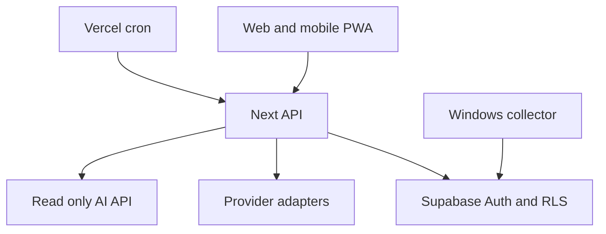

# Aachman Studios Control Center

A private dashboard for development, deployment, SEO, analytics, marketing and personal focus. The web app uses Next.js 16 and Supabase Auth with owner scoped RLS. The Windows collector is opt in and writes activity directly to the authenticated user's Supabase rows.

## What works

- Email/password sign-in, project discovery from GitHub, commit ingestion, project mapping.
- Vercel deployment, PostHog events, Search Console metrics and Windsor Instagram adapters when server credentials are configured.
- Technical homepage SEO checks with stored history; activity timeline; study/development summaries; CSV and XLSX downloads; read-only AI JSON endpoint.
- Daily cron endpoint with a server-only secret and Supabase service credential. No fabricated traffic or skill scores.

**Setup is still required:** provider credentials, project IDs/properties, a deployed site, and a signed-in account. The collector has not been tested on a physical Windows machine. Tauri packaging, Google OAuth token refresh, a complete multi-page crawler, and an LLM-generated daily brief are not implemented. The dashboard shows unavailable data honestly.

## Local development

Node 20+ is required. Copy `.env.example` to `.env.local` and set the Supabase project URL and publishable key. Then:

```bash
npm ci
npm run dev
npm run check
```

The `cc_` schema migrations were applied to the existing Aachman Studios Supabase project. They are in `supabase/migrations/0002_control_center.sql` and `0003_metric_upsert.sql` for reproducibility. Never apply the older `0001_initial.sql` to that project; it belongs to the discontinued local prototype. Existing product tables were not altered. Every `cc_` table has RLS.

## First use

1. Sign in or sign up with the Aachman Studios Supabase account.
2. Press **Sync GitHub**. Public repositories are discovered automatically. To include private repositories, configure `GITHUB_TOKEN` with the minimum necessary repository read access.
3. In Projects, map each relevant repository to its HTTPS website, Vercel project ID, PostHog project ID, or Search Console property.
4. Trigger provider syncs. Credentials are server environment variables: `VERCEL_TOKEN`, `POSTHOG_PERSONAL_API_KEY`, `GOOGLE_SEARCH_CONSOLE_ACCESS_TOKEN`, `WINDSOR_API_KEY`, `WINDSOR_INSTAGRAM_ACCOUNT_ID`. Windsor's API key is sent only to its server-side API. Do not expose these in `NEXT_PUBLIC_*`.
5. For daily server sync, set `CRON_SECRET` and `SUPABASE_SERVICE_ROLE_KEY` in Vercel. The cron runs at 03:00 UTC. The service role belongs only in server environment variables.

Search Console's access token expires. An OAuth refresh flow must be added before this connection can remain automatic indefinitely. Provider access and their account-specific permissions cannot be inherited from ChatGPT plugins into the deployed app.

## Desktop collector

On Windows, install Python 3.10+ and `pip install keyring`. Set `CONTROL_CENTER_URL` to the deployed dashboard URL, then run `python collector/windows.py`. Sign in once; the refresh token is stored using Windows Credential Manager. Type `pause`, `resume`, or `quit` in its terminal. It records foreground executable name, category, and elapsed time, not window titles, text, keystrokes, messages, clipboard, screenshots, microphone, or webcam. Windows execution must be tested on the actual machine before treating desktop activity as verified.

## Architecture



The read-only analytics API is `GET /api/ai?kind=projects|development|deployments|seo|analytics|marketing|activity|skills|alerts` with a Supabase access token in `Authorization: Bearer ...`. `POST /api/sync` is separate and requires sign-in. The old Node prototype under `src/` and old static files in `public/` are historical only; Next.js serves the current application.

## Verification

`npm run check` runs lint, TypeScript checks, unit tests and a production build. API smoke checks confirm `/` loads, `/api/config` loads, and `/api/report` rejects anonymous requests. Full account-level, provider-level and physical Windows verification still require working credentials and a Windows device.
