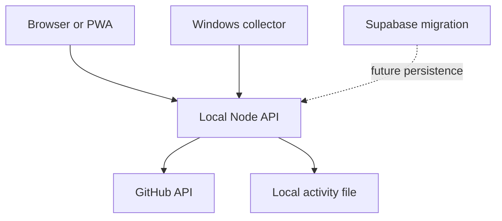

# Aachman Studios Control Center

An internal dashboard foundation for GitHub project discovery, repository activity, opt-in Windows app timing, study/development balance, CSV export, and a protected machine-readable API. **This is an early working slice, not the full production MVP in the brief.** Traffic, SEO, Supabase Auth, Vercel, PostHog, Windsor.ai, scheduled sync, and an actual Tauri desktop package are not wired up. The UI labels these as unavailable.

## Run

Node 20+ required. No npm dependencies.

```bash
export CONTROL_CENTER_TOKEN="replace-with-a-random-secret-of-at-least-32-characters"
npm start
```

Open `http://127.0.0.1:3000` and enter the same token. Optional `GITHUB_TOKEN` unlocks private repository access and higher rate limits. The current discovery route uses the public user repository endpoint, so private repo discovery still needs a future authenticated `/user/repos` adapter. All API routes require the token. Keep this server bound to localhost until Supabase Auth and hardened production deployment exist.

Windows collector: install Python 3.10+, set `CONTROL_CENTER_TOKEN` in its environment, then run `python collector/windows.py`. It records executable name and start/end times, groups idle after two minutes, and uploads only when running. Ctrl+C stops it. It does not capture titles, keystrokes, messages, clipboard, screenshots, microphone, or webcam. Local sessions live in `data/activity.ndjson` and can be erased by deleting that file while the server is stopped.

## Architecture



## API

Bearer token required in `Authorization` header. `GET /api/projects`, `GET /api/projects/{repo}/activity`, `GET /api/activity`, `GET /api/summary`, `GET /api/export/activity.csv`. `POST /api/activity` accepts `{app,start,end,category?,project?}`. Read operations are read-only; the collector upload is deliberately a separate write route. See `openapi.yaml` for a machine-readable subset. Keep the token server-side when adding an AI bridge; this browser client uses a tab-only token and does not persist it.

## Database

`supabase/migrations/0001_initial.sql` is an unapplied migration for a **new dedicated project**. The connected Aachman Studios and StudyFlow projects contain unrelated data and were left untouched. RLS scopes rows to `auth.uid()`. Do not apply this migration to either existing project without first choosing a home for Control Center.

## Deployment and limitations

This server is localhost-only and intentionally cannot be deployed as a Vercel static project. Before publishing: implement Supabase Auth, database persistence, production token management, scheduled adapters, HTTPS, rate limiting, and desktop packaging. No service-role key belongs in the browser or git. Source repository: `https://github.com/aachaman52/DashBoard-`. Clone it with `git clone https://github.com/aachaman52/DashBoard-.git`.

## Checks

`npm run check` runs syntax validation and unit tests. CI runs the same command. Current tests cover percent-change edge cases, time aggregation, and neutral browser classification. Further integration and end-to-end tests are needed before production use.
